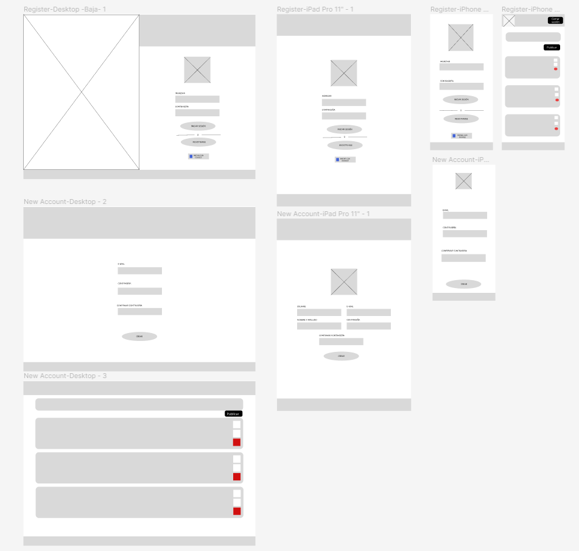
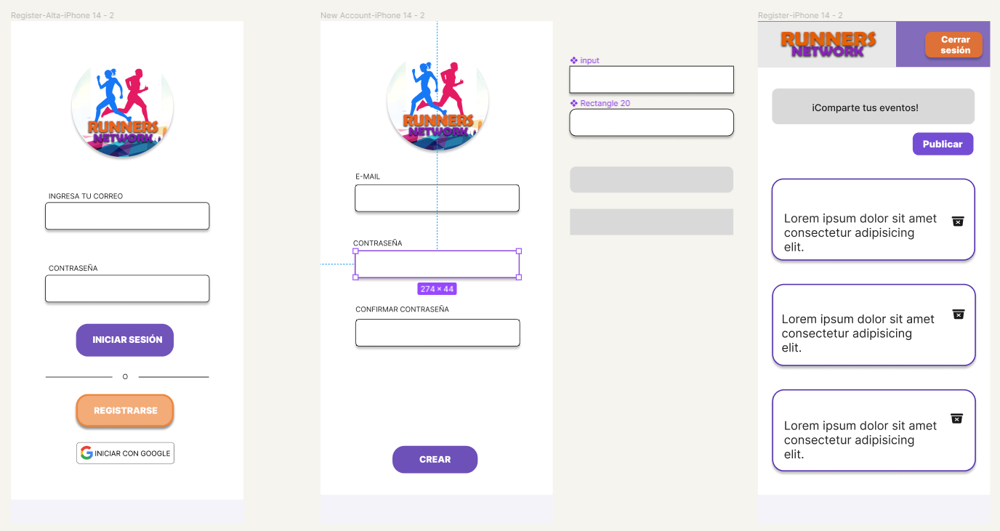

## Índice

* [1. Resumen del proyecto](#1-resumen-del-proyecto)
* [2. Principales usuarios del producto](#2-Principales-usuarios-del-proyecto)
* [3. Historias de usuario](#3-Histrias-de-usuario)
* [4. Prototipo de baja fidelidad](#4-Prototipo-de-baja-fidelidad)
* [5. Prototipo de alta fidelidad](#5-Prototipo-de-alta-fidelidad)
* [6. Herramientas](#6-Herramientas)
* [7. Despliegue de pagina](#7-Despliegue-de-la-pagina)

## 1. Resumen del proyecto

RunnersNetwork es una Single-page Application (SPA) responsive desarrollada en Firebase. Es una red social para corredores que les permite conectarse, compartir información sobre eventos de running, interactuar y motivarse mutuamente. Las principales funcionalidades incluyen registro de usuarios, inicio de sesión, inicio de sesión automático con Google, publicación de información sobre carreras y eliminación de publicaciones existentes.

## 2. Principales usuarios del producto

Los principales usuarios del producto son los corredores y entusiastas del running, pueden ser tanto principiantes como corredores más experimentados que buscan información y desean conectarse con otros corredores, compartir eventos y obtener motivación para alcanzar sus metas.

### ¿Qué problema resuelve el producto?
Al proporcionar una aplicación específica para runners, el producto ofrece a los usuarios una forma conveniente de conectar, interactuar y compartir información relacionada con el running.

### ¿Para qué le servirá esto a los usuarios?

* Conexión y comunidad: Les permitirá conectarse con otros corredores, creando una comunidad donde puedan compartir experiencias, consejos, logros y retos.

* Información sobre eventos: Les brindará acceso a eventos de  running, como carreras, maratones y encuentros, proporcionándoles información detallada sobre fechas, ubicaciones, distancias y requisitos de inscripción.

* Interacción social: Proporcionará un espacio donde los usuarios podrán interactuar, dar "like" a las publicaciones de otros corredores, lo que fomentará la interacción social y la construcción de relaciones dentro de la comunidad de running.

## 3. Historias de usuario

### Registro de usuario:
Como usuario interesado en unirme a la red social quiero poder crear una cuenta de acceso para poder acceder a todas las funcionalidades de la plataforma.

* Criterios de aceptación:
  - La página de registro debe incluir campos para el correo y contraseña.
  -  Al completar el registro, debo ser dirigido a la página de inicio.

* Definición de terminado:
  -  Se ha implementado una página de registro funcional que captura los datos requeridos.
  -  Se han implementado las validaciones necesarias en los campos de entrada. 
  -  Los datos de la cuenta se almacenan de forma segura en la base de datos.
  -  El usuario es redirigido correctamente a la página de inicio de sesión.

### Inicio de sesión:
Como usuario registrado, quiero poder iniciar sesión con mi correo y contraseña, para acceder a todas las funcionalidades.

* Criterios de aceptación:
  -  La página de inicio debe incluir un campo para el correo y contraseña.
  -  En caso que tengas un error al ingresar los datos, podrás ver un mensaje de alert, indicando que revises tus datos ingresados.
  -  Al iniciar sesión correctamente, debo ser dirigido al muro de publicaciones.

* Definición de terminado : 
  -  Se ha implementado una página de inicio de sesión funcional.
  -  Los datos ingresados en los campos de sesión se validan correctamente.
  -  Al iniciar sesión correctamente, el usuario es dirigido al muro de publicaciones.

### Inicio de sesión automático con Google:
Como usuario registrado, quiero poder acceder automáticamente con mi cuenta vinculada en google, para facilitar el proceso de inicio de sesión.

* Criterios de aceptación:
  -  En la página de inicio de sesión, debe haber una opción para iniciar sesión con Gmail.
  -  Al seleccionar la opción de inicio de sesión con Gmail, debo ser redirigido a la página de autenticación de Gmail.
  -  Después de autenticarme exitosamente con Gmail, debo ser redirigido a la pantalla de publicaciones.

* Definición de terminado :
  -  En la página de inicio de sesión, se muestra un botón para iniciar sesión con Gmail.
  -  Al seleccionar la opción de inicio de sesión con Gmail, se redirige al usuario a la página de autenticación de Gmail.
  -  Después de autenticarse exitosamente con Gmail, el usuario es redirigido a la pantalla de publicaciones.

### Publicar:
Como corredor de maratón quiero poder ver y publicar información sobre alguna carrera de maratón, como el nombre del evento, fecha, ubicación y cualquier otro dato relevante.

* Criterios de aceptación :
  -  Debe tener un área donde pueda escribir y publicar contenido.
  -  Al publicar debe ser visible a cualquier usuario.

* Definición de terminado :
  -  Se ha implementado un área de publicaciones en la página principal. 
  -  El área permite ingresar texto.
  -  Al publicar se muestra correctamente en la página principal, siendo visible a todos los usuarios.

### Borrar una publicación:
Como usuario de la Red Social de corredores de maratón, quiero poder eliminar mis publicaciones existentes si ya no deseo que estén disponibles en la plataforma.

* Criterios de aceptación :
  -  En la página de detalle de una publicación, debo tener la opción de eliminarla si soy el autor.
  -  Al confirmar la eliminación, la publicación debe desaparecer de la página principal.

* Definición de terminado : 
  -  En la página de detalle de una publicación, debo tener la opción de eliminarla si soy el autor.
  -  Al confirmar la eliminación, la publicación debe desaparecer de la página principal.

## 4. Prototipo de baja:

## 5. Prototipo de alta

## 7. Despliegue de pagina

Links

  * [Función Callback - MDN](https://developer.mozilla.org/es/docs/Glossary/Callback_function)

## Creditos:

[Cecilia Panta]
[Mabel Cárdenas]
[Odett Pargas].
