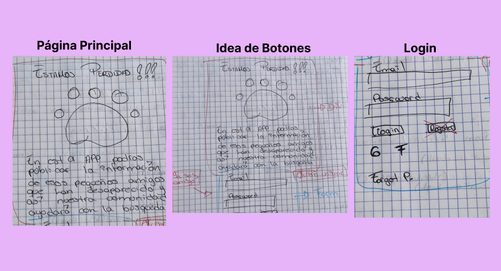
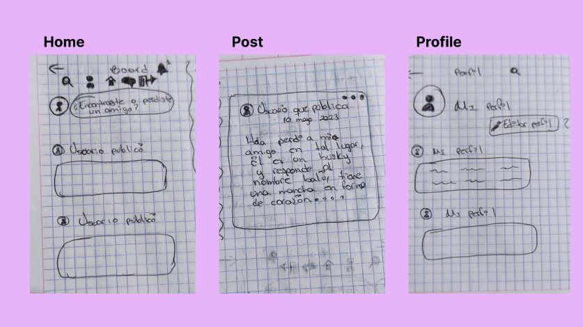
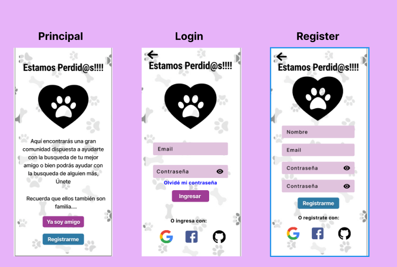
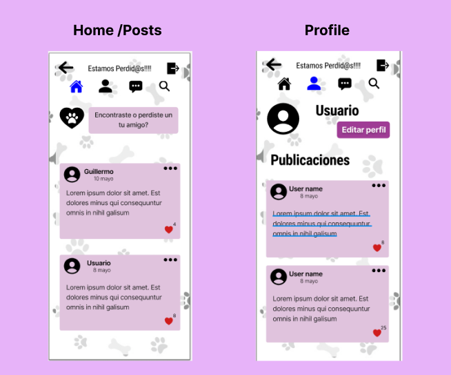
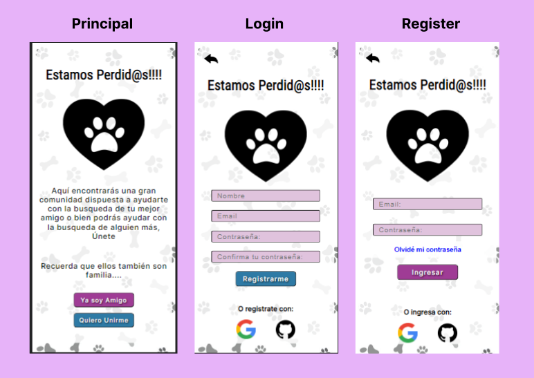
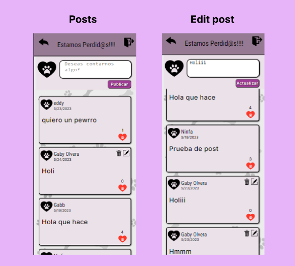

# Estamos Predid@s!!!. Red Social para ti que consideras a tu mascota parte de tu familia.

## Índice

* [1. Definición del producto](#1-definicion-del-producto)
* [2. Historias de usuario](#2-historias-de-usuario)
* [3. Diseño de la Interfaz de Usuario](#3-diseño-de-la-interfaz-del-usuario)
* [4. Consideraciones del comportamiento de la interfaz de usuario](#4-consideraciones-del-comportamiento-de-la-interfaz-de-usuario)
* [5. Consideraciones técnicas Front-end](#5-consideraciones-tecnicas-front-end)
* [6. Consideraciones técnicas UX](#6-consideraciones-tecnicas-ux)
* [7. Proyecto final](#7-proyecto-final)

## 1. Definición del producto
"Estamos Perdid@s!!!" es una aplicación que está dirigida a usuarios que son dueños de mascotas o que están planeando adoptar una mascota. Tiene como objetivo proporcionarles información y ayuda cuando han perdido a su mascota o cuando encuentran una mascota situación de calle y buscan encontrarle un hogar. El enfoque de la aplicación surge a partir de una preocupante situación en México ya que según el INEGI, existen cerca de 23 millones de perros y gatos, de los cuales el 70% se encuentra en situación de calle debido a diversos motivos.

Esta cifra coloca a México como el país número uno en toda Latinoamérica con la mayor población de perros y gatos callejeros. Con este contexto en mente, esta aplicación busca contribuir a reducir, aunque sea en pequeña medida, esta alarmante cifra. Al proporcionar información y recursos a los usuarios, se espera ayudar a los dueños de mascotas a encontrar a sus animales perdidos o bien ayudando a encontrar nuevos hogares para las mascotas encontradas en la calle abordando así este gran problema en el país.

## 2. Historias de usuario
Después de realizar entrevistas con los usuarios potenciales de mi aplicación, pude identificar las necesidades y objetivos principales que guiarán su desarrollo. Estas entrevistas me permitieron comprender mejor las preocupaciones y desafíos que enfrentan los dueños de mascotas y las personas que encuentran mascotas perdidas en la calle. Basándome en esta información, he definido las siguientes historias de usuario para mi aplicación:
### HU1: Página principal.
Yo: Como dueño de una mascota perdida o usuario interesado en adoptar. 
Quiero: Obtener información de la app. 
Para: Saber si me ayudará con mi objetivo.

*Criterios de aceptación:
- [ ] Logo de la app relacionado al tema.
- [ ] Titulo de la app.
- [ ] Boton para ir al registro.
- [ ] Boton para ir al login.

*Definición de terminado:
- [ ] Prototipo de baja y alta fidelidad de esta primera historia.
- [ ] Correcto funcionamiento de los inputs con las rutas.
- [ ] Todo esta realizado en SPA (single page aplication)

### HU2: Register.
Yo: Como dueño de una mascota perdida o usuario interesado en adoptar.  
Quiero: Poder registrarme en la app. 
Para: Tener acceso y obtener la información que busco.

*Criterios de aceptación:
- [ ] Titulo de la app.
- [ ] Logo de la app.
- [ ] Registro en la app con correo y contraseña.
- [ ] La contraseña debe ser secreta.
- [ ] La contraseña debe coincidir con el input de confirmación de contraseña.
- [ ] Registro con google.
- [ ] Input que solicite el nombre del usuario.
- [ ] No permitir continuar si el usuario no ingresa su nombre.
- [ ] Mensaje de error si el usuario ingresó un email no válido.
- [ ] Mensaje de error si el usuario ingresó una contraseña no válida.
- [ ] Mensaje de error si las contraseñas del usuario no coinciden.

*Definición de terminado:
- [ ] Prototipo de baja y alta fidelidad de esta historia.
- [ ] Vincular las cuentas registradas con el Firebase.
- [ ] Uso del input de tipo password.
- [ ] Correcto funcionamiento de los inputs con las rutas.
- [ ] Si hay mensajes de error el usuario no puede finalizar el registro.
- [ ] Todo esta realizado en SPA (single page aplication)

### HU3: Login.
Yo: Como dueño de una mascota perdida o usuario interesado en adoptar.  
Quiero: Ingresar a la app con mis credenciales 
Para: Tener acceso a la app y ver si hay información nueva.

*Criterios de aceptación:
- [ ] Titulo de la app.
- [ ] Logo de la app.
- [ ] Ingresar a la app con correo y contraseña.
- [ ] La contraseña debe ser secreta.
- [ ] Ingresar con google.
- [ ] No permitir continuar si el correo o contraseña son incorrectos
- [ ] Mensaje de error si el usuario ingresó un email no válido.
- [ ] Mensaje de error si el usuario ingresó una contraseña no válida.

*Definición de terminado:
- [ ] Prototipo de baja y alta fidelidad de esta historia.
- [ ] Acceder a la cuenta registrada en Firebase.
- [ ] Uso del input de tipo password.
- [ ] Correcto funcionamiento de los inputs con las rutas.
- [ ] Si hay mensajes de error el usuario no puede ingresar.
- [ ] Todo esta realizado en SPA (single page aplication)

### HU4: Posts.
Yo: Como dueño de una mascota perdida o usuario interesado en adoptar.  
Quiero: Hacer una publicación. 
Para: Compartir información que pu

ede ser util a los usuario.

*Criterios de aceptación:
- [ ] Botón Logout.
- [ ] Botón página anterior.
- [ ] Textarea para hacer un post.
- [ ] Botón de publicar.
- [ ] Que el post aparezca en tiempo real.
- [ ] No permitir un post vacío.

*Definición de terminado:
- [ ] Prototipo de baja y alta fidelidad de esta historia.
- [ ] Hacer uso de database Firestore.
- [ ] Crear una publicación
- [ ] Borrar una publicación creada por el usuario que la quiere eliminar.
- [ ] Editar una publicación creada por el usuario que la quiere eliminar.
- [ ] Darle like a una publicación, únicamente un like por usuario.

## 3. Diseño de la Interfaz de Usuario
### Sketch: Baja fidelidad.

### Sketch: Alta fidelidad.

## 4. Tests de usabilidad
Los problemas que se detectaron mediante los test de usabilidad y feedbacks fueron:

*Colores de los botones.
*Tamaño de los botones.
*Tamaño de la letra.
*Fondo de la App.
*Uso de iconos en lugar de letras.
*Dar más información al usuario para el uso de la app.

## 5. Interfaz final

