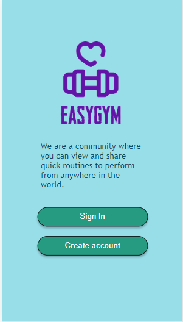
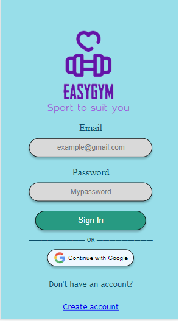
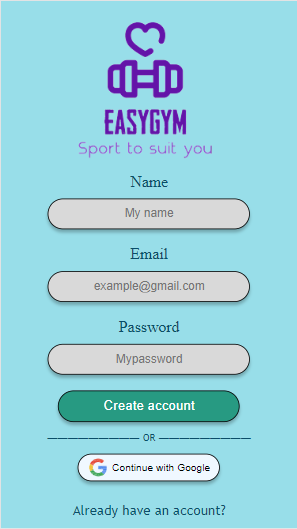
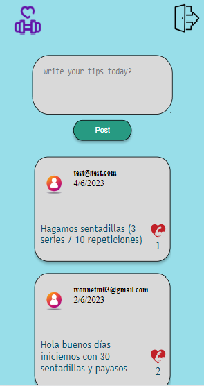

# Red Social - EasyGym

## Índice

* [1. Preámbulo](#1-preámbulo)
* [2. Resumen del proyecto](#2-resumen-del-proyecto)
* [3. Pantalla Principal](#3-pantalla-principal)
* [4. Pantalla Sign In](#4-pantalla-sign-in)
* [5. Pantalla Create Account](#5-pantalla-create-account)
* [6. Pantalla de Muro](#6-pantalla-de-muro)

## 1. Preámbulo

Instagram, Snapchat, Twitter, Facebook, Twitch, Linkedin, etc. Las redes
sociales han invadido nuestras vidas. Las amamos u odiamos, y muchos no podemos
vivir sin ellas.

Hay redes sociales de todo tipo y para todo tipo de intereses. 

## 2. Resumen del proyecto

En este proyecto construímos una red social dedicada a una comunidad que puede crear, ver y compartir rutinas rápidas de ejercicio que pueden ser realizadas desde cualquier parte del mundo y en cualquier lugar, ya sea casa, jardín, parque o un centro deportivo.
Para realizarlo creamos un proyecto en Firebas y en este una colección para guardar los post de los usuarios.
Para dar inicio a este proyecto utilizamos Figma para crear los prototipos de baja y alta fidelidad, también utilizamos Trello para definir las historias de usuario y para organizar, planificar y distribuir las tareas para cada sprint.

### Los objetivos generales de este proyecto son los siguientes

* Qué cada usuario cree una cuenta.
* Qué cada usuario pueda iniciar sesión.
* Comparta rutinas.
* Revise tips del resto de los usuarios.
* Pueda dar likes a cualquier publicación.
* Pueda editar sus publicaciones.
* Pueda eliminar sus publicaciones.

## 3. Pantalla Principal

Esta es la pantalla inicial dónde podemos encontrar una breve descripción del propósito de la página. También nos da la opción de ingresar con Sign In (si ya contamos con una cuenta) o con Create Account (si no tenemos cuenta y deseamos crearla)

## 4. Pantalla Sign In

En esta sección, utilizando Firebase Authentication, podemos ingresar a la página con el usuario y contraseña que previamente creamos. También nos da la opción de ingresar con nuestra cuenta de Google. Finalmente, mediante este sitio, podemos irnos a crear una cuenta si es que todavía no la hemos creado.

  
## 5. Pantalla Create Account

En esta sección, nuevamente utilizando Firebase Authentication, podemos ingresar a la página creando un usuario. Los datos que son solicitados son: nombre, correo electrónico y contraseña. También nos da la opción de ingresar con nuestra cuenta de Google. Finalmente, mediante este sitio, también podemos ingresar si ya tenemos usuario creado; en la parte final aparece un enlace que dice: Sign In.

  
## 6. Pantalla de Muro

En esta sección, utilizando Firebase firestore, podemos crear un post acerca de una rutina rápida que deseemos compartir. También podemos ver los comentarios existentes de los demás usuarios que pertenecen a la red social. Podemos dar likes a las publicaciones que sean de nuestro agrado. En este apartado, solamente quienes crearon la publicación, podrán tener habilitada la opción de editarla o eliminarla. Así como el "like" que hayan dado, sólo quien lo dio, podrá retirarlo en caso de que se haya arrepentido. Además, para cuando el usuario lo desee, se agregó un botón para cerrar la sesión. Y por último esta pantalla está protegida, por lo que solo aquellos usuarios conectado pueden ver la pantalla Muro.

